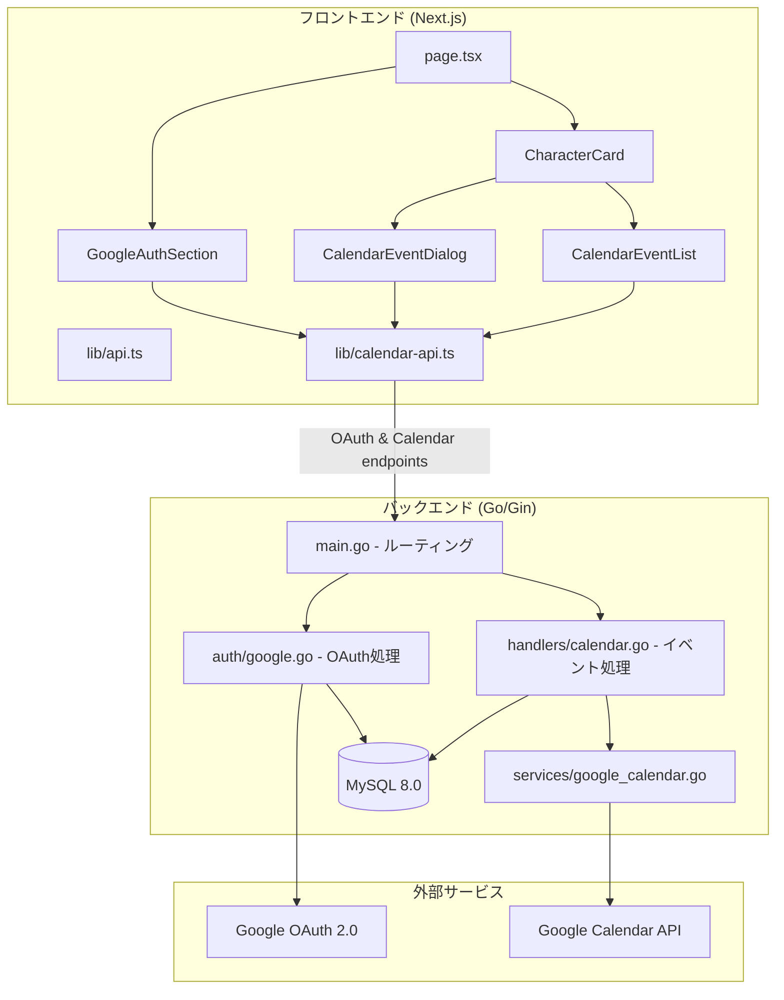
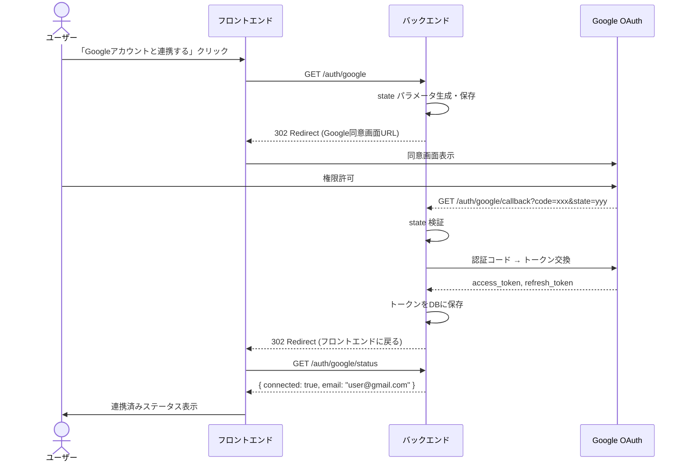
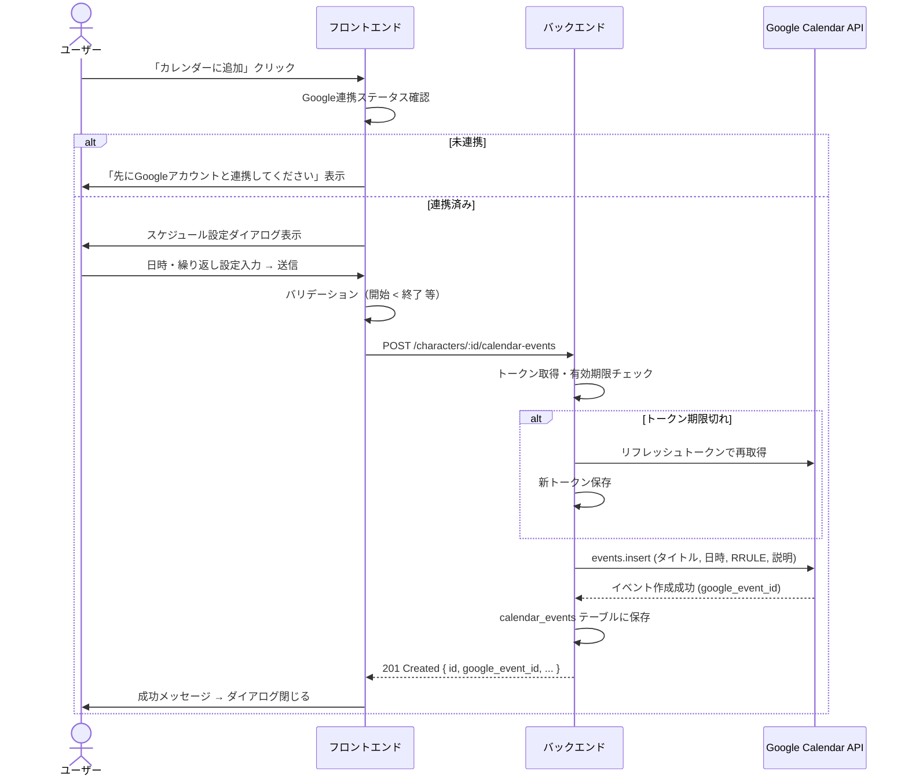
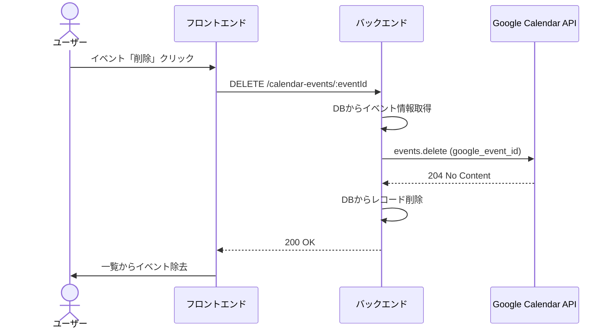
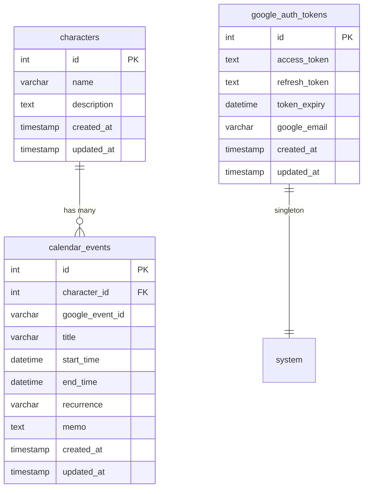

# 設計ドキュメント: Google Calendar連携

## 概要

**目的**: 登録済みロールモデルキャラクターの「発揮タイミング」をGoogle Calendarのイベントとして登録・管理する機能を提供する。ユーザーがキャラクターごとにスケジュールを設定し、Google Calendarからリマインドを受け取ることで、日常でロールモデルを意識する仕組みを実現する。

**ユーザー**: `my_roll_model` を利用する全ユーザー。ロールモデルの発揮タイミング管理ワークフローで使用する。

**影響**: バックエンドにOAuth 2.0認証とGoogle Calendar API連携機能を追加し、フロントエンドにスケジュール設定・管理UIを追加する。既存のキャラクターCRUD機能には影響を与えない。

### ゴール

- Google OAuth 2.0認証によるアカウント連携を実現する
- キャラクターごとにスケジュール設定ダイアログを提供する
- Google Calendar APIを介してイベントの作成・削除を行う
- 登録済みカレンダーイベントの一覧表示・管理を実現する

### ノンゴール

- Google Calendar以外のカレンダーサービス連携（Outlook等）
- イベント編集機能（削除して再作成で対応）
- マルチユーザー認証（現時点ではシングルユーザー前提）
- Google Calendarからのイベント読み取り・同期
- プッシュ通知機能（Google Calendar側のリマインダーに委ねる）

## アーキテクチャ

### 既存アーキテクチャの分析

現在のシステムは以下の構成：

- **フロントエンド**: Next.js 16 (App Router) + React 19 + Tailwind CSS v4
- **バックエンド**: Go 1.25 + Gin + database/sql (直接SQL)
- **データベース**: MySQL 8.0
- **インフラ**: Docker Compose

現在のバックエンドは `main.go` にモノリシックにハンドラーが定義されている。今回の機能追加でもこのパターンを踏襲するが、Google Calendar関連のロジックは別ファイルに分離する。

### アーキテクチャパターンとバウンダリマップ



**アーキテクチャ統合**:

- **選択パターン**: 既存のモノリシックGin APIにハンドラー・サービスをファイル分離して追加
- **ドメイン境界**: OAuth認証 / カレンダーイベント管理 / 既存キャラクターCRUDの3領域
- **既存パターン維持**: Ginルーティング、直接SQL、fetch APIクライアント
- **新規コンポーネント理由**: Google API連携はロジックが複雑なため、`services/` にビジネスロジック、`handlers/` にHTTPハンドラーを分離

### 技術スタック

| レイヤー       | 選択 / バージョン                   | 本機能での役割                            | 備考     |
| -------------- | ----------------------------------- | ----------------------------------------- | -------- |
| フロントエンド | Next.js 16 / React 19               | スケジュール設定UI、OAuth連携UI           | 既存     |
| スタイリング   | Tailwind CSS v4                     | ダイアログ・フォーム・一覧のスタイリング  | 既存     |
| バックエンド   | Go 1.25 / Gin                       | REST API、OAuth仲介、Calendar API呼び出し | 既存     |
| Google SDK     | `google.golang.org/api/calendar/v3` | Calendar API クライアント                 | 新規追加 |
| Google OAuth   | `golang.org/x/oauth2/google`        | OAuth 2.0 フロー                          | 新規追加 |
| データベース   | MySQL 8.0                           | イベント情報・トークン永続化              | 既存     |
| インフラ       | Docker Compose                      | 環境変数によるGoogle API設定注入          | 既存     |

## システムフロー

### フロー1: Google OAuth 2.0 認証フロー



**フロー決定事項**:

- state パラメータによるCSRF防止を実装
- シングルユーザー前提のため、トークンはDB上で1レコードのみ保持（upsert方式）
- コールバック後はフロントエンドのトップページにリダイレクト

### フロー2: カレンダーイベント作成フロー



### フロー3: カレンダーイベント削除フロー



## 要件トレーサビリティ

| 要件    | 概要                           | コンポーネント                         | インターフェース                     | フロー  |
| ------- | ------------------------------ | -------------------------------------- | ------------------------------------ | ------- |
| 1.1     | Google連携ボタン表示           | GoogleAuthSection                      | -                                    | -       |
| 1.2     | OAuth認証フロー開始            | GoogleAuthSection, AuthHandler         | GET /auth/google                     | フロー1 |
| 1.3     | トークン交換・保存             | AuthHandler                            | GET /auth/google/callback            | フロー1 |
| 1.4     | 連携済みステータス表示         | GoogleAuthSection                      | GET /auth/google/status              | フロー1 |
| 1.5     | トークン自動リフレッシュ       | GoogleCalendarService                  | -                                    | フロー2 |
| 1.6     | 連携解除                       | GoogleAuthSection, AuthHandler         | DELETE /auth/google                  | -       |
| 2.1     | カレンダーに追加ボタン         | CharacterCard                          | -                                    | -       |
| 2.2     | スケジュール設定ダイアログ表示 | CalendarEventDialog                    | -                                    | フロー2 |
| 2.3     | 入力フィールド                 | CalendarEventDialog                    | -                                    | -       |
| 2.4     | 繰り返し設定                   | CalendarEventDialog                    | -                                    | -       |
| 2.5     | バリデーション                 | CalendarEventDialog                    | -                                    | フロー2 |
| 2.6     | ダイアログキャンセル           | CalendarEventDialog                    | -                                    | -       |
| 3.1     | イベント作成API呼び出し        | CalendarEventDialog, CalendarApiClient | POST /characters/:id/calendar-events | フロー2 |
| 3.2     | Google Calendar events.insert  | CalendarHandler, GoogleCalendarService | Google Calendar API                  | フロー2 |
| 3.3     | イベント内容設定               | GoogleCalendarService                  | Google Calendar API                  | フロー2 |
| 3.4     | RRULE繰り返し設定              | GoogleCalendarService                  | Google Calendar API                  | フロー2 |
| 3.5     | 成功メッセージ・ダイアログ閉じ | CalendarEventDialog                    | -                                    | フロー2 |
| 3.6     | エラーメッセージ表示           | CalendarEventDialog                    | -                                    | フロー2 |
| 3.7     | 未認証時のガイド               | CalendarEventDialog                    | -                                    | フロー2 |
| 4.1     | イベント数バッジ表示           | CharacterCard                          | -                                    | -       |
| 4.2     | イベント一覧取得               | CalendarEventList                      | GET /characters/:id/calendar-events  | -       |
| 4.3     | イベント一覧表示               | CalendarEventList                      | -                                    | -       |
| 4.4     | イベント削除                   | CalendarEventList                      | DELETE /calendar-events/:eventId     | フロー3 |
| 4.5     | 空状態メッセージ               | CalendarEventList                      | -                                    | -       |
| 5.1-5.2 | DBテーブル定義                 | MySQL                                  | -                                    | -       |
| 5.3-5.9 | APIエンドポイント              | AuthHandler, CalendarHandler           | 各REST API                           | -       |
| 5.10    | 環境変数設定                   | backend環境設定                        | -                                    | -       |
| 6.1-6.5 | エラー・UX処理                 | 全フロントエンドコンポーネント         | -                                    | -       |

## コンポーネントとインターフェース

| コンポーネント        | ドメイン/レイヤー    | 意図                                              | 要件カバー                  | 主要依存                   | コントラクト |
| --------------------- | -------------------- | ------------------------------------------------- | --------------------------- | -------------------------- | ------------ |
| GoogleAuthSection     | UI                   | Google認証連携のステータス表示・連携/解除ボタン   | 1.1, 1.2, 1.4, 1.6          | calendar-api.ts (P0)       | API          |
| CalendarEventDialog   | UI                   | スケジュール設定ダイアログ（入力フォーム）        | 2.1-2.6, 3.1, 3.5-3.7       | calendar-api.ts (P0)       | API, State   |
| CalendarEventList     | UI                   | キャラクターに紐づくイベント一覧表示・削除        | 4.1-4.5                     | calendar-api.ts (P0)       | API, State   |
| calendar-api.ts       | フロントエンド/API   | Google認証・カレンダーイベントのfetchクライアント | 全API呼び出し               | fetch API (P0)             | API          |
| AuthHandler           | バックエンド/Handler | OAuth 2.0 フローのHTTPハンドラー                  | 1.2, 1.3, 1.5, 1.6, 5.3-5.6 | GoogleCalendarService (P0) | API          |
| CalendarHandler       | バックエンド/Handler | カレンダーイベントCRUDのHTTPハンドラー            | 3.1-3.4, 5.7-5.9            | GoogleCalendarService (P0) | API          |
| GoogleCalendarService | バックエンド/Service | Google Calendar API呼び出しとトークン管理         | 1.5, 3.2-3.4                | google-api-go-client (P0)  | Service      |

### フロントエンド

#### GoogleAuthSection

| フィールド | 詳細                                                     |
| ---------- | -------------------------------------------------------- |
| 意図       | ページ上部にGoogle連携ステータスとアクションボタンを表示 |
| 要件       | 1.1, 1.2, 1.4, 1.6                                       |

**責務と制約**

- Google認証ステータスのポーリング表示（ページ読み込み時に `GET /auth/google/status` を呼び出し）
- 未連携時は「Googleアカウントと連携する」ボタン、連携済み時はメールアドレスと「連携を解除する」ボタンを表示
- バックエンドの `GET /auth/google` にリダイレクトして認証フローを開始

**依存関係**

- Outbound: `calendar-api.ts` — ステータス取得・連携解除API呼び出し (P0)

**コントラクト**: API [x] / State [x]

##### ステート管理

```typescript
interface GoogleAuthState {
  isConnected: boolean;
  email: string | null;
  isLoading: boolean;
  error: string | null;
}
```

**実装メモ**

- `page.tsx` のヘッダー下部に配置
- 認証開始は `window.location.href` でバックエンドURLへ直接遷移（SPAルーティング外）
- コールバック後のページリロードでステータスを再取得

#### CalendarEventDialog

| フィールド | 詳細                                                                   |
| ---------- | ---------------------------------------------------------------------- |
| 意図       | キャラクターに対するカレンダーイベント作成フォームのモーダルダイアログ |
| 要件       | 2.1-2.6, 3.1, 3.5-3.7, 6.1, 6.2                                        |

**責務と制約**

- `CharacterCard` からの呼び出しで開くモーダルダイアログ
- イベントタイトル（デフォルト値あり）、日付、開始時刻、終了時刻、繰り返し設定、メモの入力フォーム
- クライアントサイドバリデーション（開始時刻 < 終了時刻）
- Google未連携時は連携を促すメッセージを表示

**依存関係**

- Inbound: `CharacterCard` — ダイアログの開閉制御 (P0)
- Outbound: `calendar-api.ts` — イベント作成API呼び出し (P0)

**コントラクト**: API [x] / State [x]

##### ステート管理

```typescript
interface CalendarEventFormState {
  title: string; // デフォルト: "ロールモデル発揮: {キャラクター名}"
  date: string; // YYYY-MM-DD
  startTime: string; // HH:mm
  endTime: string; // HH:mm
  recurrence: "none" | "daily" | "weekly" | "monthly";
  memo: string;
  isSubmitting: boolean;
  error: string | null;
}
```

##### Props

```typescript
interface CalendarEventDialogProps {
  character: Character;
  isOpen: boolean;
  onClose: () => void;
  onCreated: () => void;
  isGoogleConnected: boolean;
}
```

#### CalendarEventList

| フィールド | 詳細                                                           |
| ---------- | -------------------------------------------------------------- |
| 意図       | キャラクターに紐づく登録済みカレンダーイベントの一覧表示と削除 |
| 要件       | 4.1-4.5, 6.2                                                   |

**責務と制約**

- キャラクターカード内に展開可能なセクションとして配置
- イベント一覧をバックエンドから取得して表示
- 各イベントに削除ボタンを配置

**依存関係**

- Inbound: `CharacterCard` — 一覧の展開制御 (P0)
- Outbound: `calendar-api.ts` — イベント一覧取得・削除API呼び出し (P0)

**コントラクト**: API [x] / State [x]

##### Props

```typescript
interface CalendarEventListProps {
  characterId: number;
  isGoogleConnected: boolean;
  refreshTrigger: number;
}
```

#### calendar-api.ts （フロントエンドAPIクライアント）

| フィールド | 詳細                                                                  |
| ---------- | --------------------------------------------------------------------- |
| 意図       | Google認証・カレンダーイベントに関するバックエンドAPIの呼び出しを集約 |
| 要件       | 全API呼び出し                                                         |

**コントラクト**: API [x]

##### APIコントラクト（フロントエンド側型定義）

```typescript
// --- 型定義 ---

interface GoogleAuthStatus {
  connected: boolean;
  email: string | null;
}

interface CalendarEvent {
  id: number;
  character_id: number;
  google_event_id: string;
  title: string;
  start_time: string; // ISO 8601
  end_time: string; // ISO 8601
  recurrence: string; // "none" | "daily" | "weekly" | "monthly"
  memo: string;
  created_at: string;
}

interface CreateCalendarEventRequest {
  title: string;
  date: string; // YYYY-MM-DD
  start_time: string; // HH:mm
  end_time: string; // HH:mm
  recurrence: "none" | "daily" | "weekly" | "monthly";
  memo?: string;
}

// --- 関数 ---

function getGoogleAuthUrl(): string;
// => `${API_BASE_URL}/auth/google` を返す（ブラウザリダイレクト用）

async function fetchGoogleAuthStatus(): Promise<GoogleAuthStatus>;
// => GET /auth/google/status

async function disconnectGoogle(): Promise<ApiResponse>;
// => DELETE /auth/google

async function createCalendarEvent(
  characterId: number,
  data: CreateCalendarEventRequest,
): Promise<CalendarEvent>;
// => POST /characters/:id/calendar-events

async function fetchCalendarEvents(
  characterId: number,
): Promise<CalendarEvent[]>;
// => GET /characters/:id/calendar-events

async function deleteCalendarEvent(eventId: number): Promise<ApiResponse>;
// => DELETE /calendar-events/:eventId
```

### バックエンド

#### AuthHandler (`backend/src/auth/google.go`)

| フィールド | 詳細                                          |
| ---------- | --------------------------------------------- |
| 意図       | Google OAuth 2.0 認証フローのHTTPハンドラー群 |
| 要件       | 1.2, 1.3, 1.5, 1.6, 5.3-5.6                   |

**責務と制約**

- OAuth 2.0 Authorization Code Flow の開始・コールバック処理
- state パラメータによるCSRF防止
- トークンのDB永続化（upsert：シングルユーザー前提で1行のみ）
- ステータス取得・連携解除

**依存関係**

- External: `golang.org/x/oauth2` — OAuth フロー (P0)
- Outbound: MySQL — トークン保存 (P0)

**コントラクト**: API [x]

##### APIコントラクト

| メソッド | エンドポイント        | リクエスト          | レスポンス                                     | エラー   |
| -------- | --------------------- | ------------------- | ---------------------------------------------- | -------- |
| GET      | /auth/google          | -                   | 302 Redirect → Google同意画面                  | 500      |
| GET      | /auth/google/callback | ?code=xxx&state=yyy | 302 Redirect → フロントエンド                  | 400, 500 |
| GET      | /auth/google/status   | -                   | `{ "connected": bool, "email": string\|null }` | 500      |
| DELETE   | /auth/google          | -                   | `{ "message": "..." }`                         | 500      |

**実装メモ**

- OAuth設定は `oauth2.Config` で構成。スコープは `calendar.events`
- stateは一時的にインメモリ（map + mutex）で管理。シングルユーザーのため複雑なセッション管理は不要
- コールバック後のリダイレクト先: `FRONTEND_URL` 環境変数（デフォルト `http://localhost:3000`）

#### CalendarHandler (`backend/src/handlers/calendar.go`)

| フィールド | 詳細                                             |
| ---------- | ------------------------------------------------ |
| 意図       | カレンダーイベントのCRUD操作を行うHTTPハンドラー |
| 要件       | 3.1-3.4, 5.7-5.9                                 |

**責務と制約**

- リクエストのパース・バリデーション
- GoogleCalendarService の呼び出し
- DB への CRUD 操作

**依存関係**

- Outbound: GoogleCalendarService — Google Calendar API呼び出し (P0)
- Outbound: MySQL — イベントデータ永続化 (P0)

**コントラクト**: API [x]

##### APIコントラクト

| メソッド | エンドポイント                  | リクエスト                          | レスポンス                   | エラー        |
| -------- | ------------------------------- | ----------------------------------- | ---------------------------- | ------------- |
| POST     | /characters/:id/calendar-events | `CreateCalendarEventRequest` (JSON) | `CalendarEvent` (201)        | 400, 401, 500 |
| GET      | /characters/:id/calendar-events | -                                   | `CalendarEvent[]` (200)      | 400, 500      |
| DELETE   | /calendar-events/:eventId       | -                                   | `{ "message": "..." }` (200) | 400, 404, 500 |

##### リクエスト/レスポンス型（Go構造体）

```go
// リクエスト
type CreateCalendarEventRequest struct {
    Title      string `json:"title" binding:"required"`
    Date       string `json:"date" binding:"required"`       // YYYY-MM-DD
    StartTime  string `json:"start_time" binding:"required"` // HH:mm
    EndTime    string `json:"end_time" binding:"required"`   // HH:mm
    Recurrence string `json:"recurrence"`                    // none|daily|weekly|monthly
    Memo       string `json:"memo"`
}

// レスポンス / DBエンティティ
type CalendarEvent struct {
    ID            int       `json:"id"`
    CharacterID   int       `json:"character_id"`
    GoogleEventID string    `json:"google_event_id"`
    Title         string    `json:"title"`
    StartTime     time.Time `json:"start_time"`
    EndTime       time.Time `json:"end_time"`
    Recurrence    string    `json:"recurrence"`
    Memo          string    `json:"memo"`
    CreatedAt     time.Time `json:"created_at"`
    UpdatedAt     time.Time `json:"updated_at"`
}
```

#### GoogleCalendarService (`backend/src/services/google_calendar.go`)

| フィールド | 詳細                                                            |
| ---------- | --------------------------------------------------------------- |
| 意図       | Google Calendar APIとの通信およびトークン管理のビジネスロジック |
| 要件       | 1.5, 3.2-3.4                                                    |

**責務と制約**

- OAuth2トークンからGoogle Calendar APIクライアントの生成
- `events.insert` によるイベント作成
- `events.delete` によるイベント削除
- 繰り返し設定のRRULE変換
- トークンの自動リフレッシュ

**依存関係**

- External: `google.golang.org/api/calendar/v3` — Calendar API (P0)
- External: `golang.org/x/oauth2` — トークンリフレッシュ (P0)
- Outbound: MySQL — リフレッシュ後のトークン更新 (P0)

**コントラクト**: Service [x]

##### サービスインターフェース

```go
type GoogleCalendarService interface {
    // Google Calendar にイベントを作成し、google_event_id を返す
    CreateEvent(token *oauth2.Token, event CalendarEventInput) (string, error)

    // Google Calendar からイベントを削除する
    DeleteEvent(token *oauth2.Token, googleEventID string) error

    // トークンの有効性を確認し、必要に応じてリフレッシュする
    EnsureValidToken(token *oauth2.Token) (*oauth2.Token, error)
}

type CalendarEventInput struct {
    Title       string
    Description string
    StartTime   time.Time
    EndTime     time.Time
    Recurrence  string // "none", "daily", "weekly", "monthly"
}
```

**実装メモ**

- RRULE変換ロジック:
  - `"none"` → RRULE なし
  - `"daily"` → `RRULE:FREQ=DAILY`
  - `"weekly"` → `RRULE:FREQ=WEEKLY`
  - `"monthly"` → `RRULE:FREQ=MONTHLY`
- イベント説明にキャラクター情報とユーザーメモを結合して設定
- `oauth2.Config.Client()` を使用することで、トークンリフレッシュは自動的に行われる

## データモデル

### ドメインモデル



**ビジネスルール & 不変条件**:

- `calendar_events.character_id` は `characters.id` への外部キー（CASCADE DELETE）
- `google_auth_tokens` はシングルユーザー前提のため最大1行
- `start_time` は常に `end_time` より前であること

### 物理データモデル

#### calendar_events テーブル

```sql
CREATE TABLE IF NOT EXISTS calendar_events (
    id INT PRIMARY KEY AUTO_INCREMENT,
    character_id INT NOT NULL,
    google_event_id VARCHAR(255) NOT NULL,
    title VARCHAR(255) NOT NULL,
    start_time DATETIME NOT NULL,
    end_time DATETIME NOT NULL,
    recurrence VARCHAR(20) NOT NULL DEFAULT 'none',
    memo TEXT,
    created_at TIMESTAMP DEFAULT CURRENT_TIMESTAMP,
    updated_at TIMESTAMP DEFAULT CURRENT_TIMESTAMP ON UPDATE CURRENT_TIMESTAMP,
    FOREIGN KEY (character_id) REFERENCES characters(id) ON DELETE CASCADE,
    INDEX idx_character_id (character_id),
    INDEX idx_google_event_id (google_event_id)
) ENGINE=InnoDB DEFAULT CHARSET=utf8mb4 COLLATE=utf8mb4_unicode_ci;
```

#### google_auth_tokens テーブル

```sql
CREATE TABLE IF NOT EXISTS google_auth_tokens (
    id INT PRIMARY KEY AUTO_INCREMENT,
    access_token TEXT NOT NULL,
    refresh_token TEXT NOT NULL,
    token_expiry DATETIME NOT NULL,
    google_email VARCHAR(255),
    created_at TIMESTAMP DEFAULT CURRENT_TIMESTAMP,
    updated_at TIMESTAMP DEFAULT CURRENT_TIMESTAMP ON UPDATE CURRENT_TIMESTAMP
) ENGINE=InnoDB DEFAULT CHARSET=utf8mb4 COLLATE=utf8mb4_unicode_ci;
```

### データコントラクト

**API データ転送**:

- 全APIのリクエスト/レスポンスは JSON 形式
- 日時フォーマット: ISO 8601 (`2026-03-06T09:00:00+09:00`)
- 繰り返し設定: enum文字列 (`"none"`, `"daily"`, `"weekly"`, `"monthly"`)

## エラーハンドリング

### エラー戦略

既存のパターン（Gin の `c.JSON(statusCode, gin.H{"error": message})` によるエラーレスポンス）を踏襲する。フロントエンドでは `calendar-api.ts` でエラーをキャッチし、コンポーネントレベルでユーザーにフィードバックする。

### エラーカテゴリとレスポンス

**ユーザーエラー (4xx)**:

- 400: バリデーションエラー（日時不正、必須フィールド欠落）→ フィールドレベルのエラーメッセージ
- 401: Google認証未完了/期限切れ → 「Googleアカウントと連携してください」メッセージ
- 404: イベント未発見 → 一覧をリフレッシュ

**システムエラー (5xx)**:

- 500 (DB障害): 「サーバーエラーが発生しました。時間をおいて再試行してください」
- 500 (Google API障害): 「Google Calendarとの通信に失敗しました。再試行してください」

**Google API 固有エラー**:

- 401/403 (トークン無効): リフレッシュを試行。失敗した場合は再認証を促す
- 429 (レート制限): リトライ指示またはしばらく待つようガイド

## テスト戦略

### ユニットテスト

- RRULE変換ロジック（recurrence → RRULE文字列）の正確性
- バリデーションロジック（開始時刻 < 終了時刻、必須フィールド）
- フロントエンドの `CalendarEventDialog` バリデーション関数
- トークンリフレッシュ判定ロジック

### 統合テスト

- OAuth コールバック → トークン保存 → ステータス取得の一連の流れ
- イベント作成API → DB保存 → Google Calendar API呼び出しのフロー（モック使用）
- イベント削除API → Google Calendar削除 → DB削除のフロー（モック使用）
- キャラクター削除時の関連カレンダーイベントのカスケード削除

### E2E/UIテスト

- Google連携ボタン → 認証フロー → 連携済み表示の流れ
- スケジュール設定ダイアログの入力 → バリデーション → 送信
- イベント一覧表示 → 削除操作
- 未連携状態でカレンダーボタン押下時のエラーメッセージ表示

## セキュリティ考慮事項

- **トークン保管**: アクセストークン・リフレッシュトークンはDBに保存。本番運用時は暗号化を検討
- **CSRF防止**: OAuth state パラメータによるCSRF攻撃防止
- **スコープ最小化**: `calendar.events` スコープのみ要求（カレンダー全体への読み取りは不要）
- **環境変数**: Google API クレデンシャルは環境変数で管理し、コードにハードコードしない
- **CORS設定**: 既存の `AllowOrigins` にフロントエンドURLを含む（対応済み）
