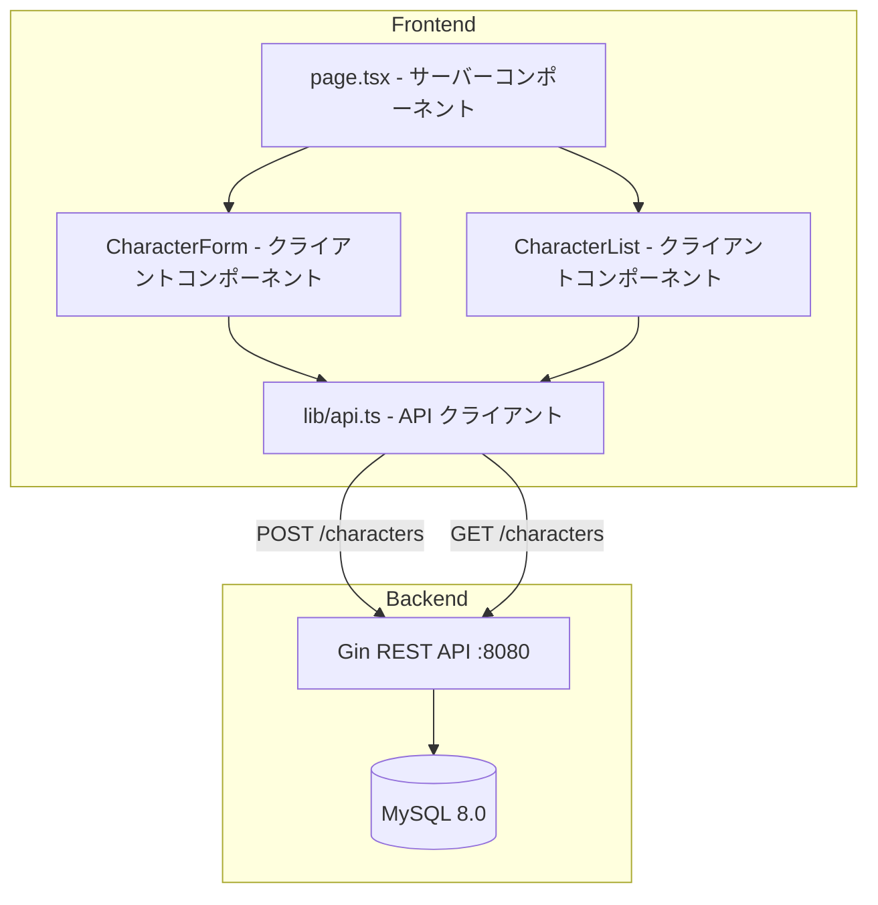
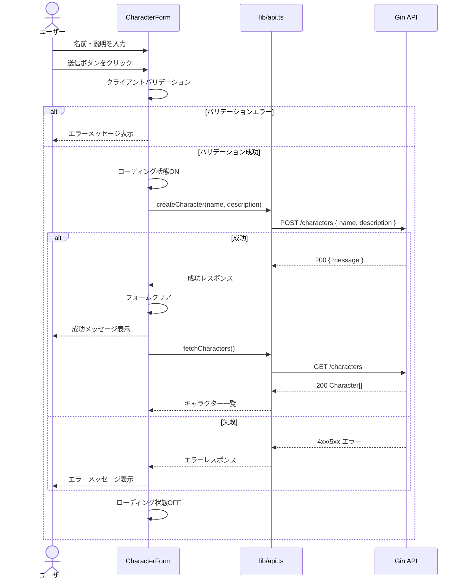

# 設計ドキュメント: ロールモデル入力フォーム

## 概要

**目的**: ユーザーが自身のロールモデル（キャラクター）の名前と説明を入力し、バックエンドAPIに登録できるフロントエンド画面を提供する。併せて、登録済みキャラクターの一覧表示機能を同一画面内に配置する。

**ユーザー**: `my_roll_model` を利用する全ユーザー。ロールモデルの登録・閲覧ワークフローで使用する。

**影響**: 現在のNext.jsデフォルトトップページ (`frontend/app/page.tsx`) をロールモデル管理画面に置き換える。

### ゴール

- キャラクターの名前・説明を入力してバックエンドに送信できるフォームを実装する
- 登録済みキャラクター一覧をリアルタイムに表示する
- バリデーション・エラーハンドリング・ローディング状態を適切に処理する
- モバイル/デスクトップ対応のレスポンシブUIを提供する

### ノンゴール

- キャラクターの編集・削除機能（将来対応）
- ユーザー認証・認可
- ページネーション・検索・フィルター機能
- バックエンドAPIの変更

## アーキテクチャ

### アーキテクチャパターン



**アーキテクチャ統合**:

- **選択パターン**: Next.js App Router のクライアントコンポーネントパターン。フォームはユーザーインタラクションを伴うためクライアントコンポーネントとして実装する。
- **ドメイン境界**: フロントエンドはAPIクライアント層を介してバックエンドと通信。直接DB操作は行わない。
- **既存パターン維持**: `app/` ディレクトリのファイルベースルーティング、Tailwind CSS によるスタイリング
- **新規コンポーネント理由**: フォーム・一覧表示・APIクライアントは関心事の分離のため個別コンポーネント化

### 技術スタック

| レイヤー         | 技術 / バージョン       | 本機能での役割                   | 備考               |
| ---------------- | ----------------------- | -------------------------------- | ------------------ |
| フロントエンド   | Next.js 16 (App Router) | ページルーティング・レンダリング | 既存               |
| UI               | React 19                | コンポーネント描画・状態管理     | 既存               |
| スタイリング     | Tailwind CSS v4         | UIスタイリング                   | 既存               |
| HTTPクライアント | fetch API               | バックエンドAPI通信              | ブラウザネイティブ |
| バックエンド     | Go / Gin :8080          | REST API(`POST/GET /characters`) | 既存・変更なし     |
| データストア     | MySQL 8.0               | キャラクターデータ永続化         | 既存・変更なし     |

## システムフロー

### キャラクター登録フロー



## 要件トレーサビリティ

| 要件 | 概要                             | コンポーネント               | インターフェース       | フロー         |
| ---- | -------------------------------- | ---------------------------- | ---------------------- | -------------- |
| 1.1  | 名前・説明入力フィールド         | CharacterForm                | FormProps              | -              |
| 1.2  | 名前最大255文字                  | CharacterForm                | -                      | -              |
| 1.3  | 説明は複数行テキストエリア       | CharacterForm                | -                      | -              |
| 1.4  | プレースホルダー表示             | CharacterForm                | -                      | -              |
| 2.1  | 名前空欄エラー                   | CharacterForm                | -                      | バリデーション |
| 2.2  | 名前255文字超過エラー            | CharacterForm                | -                      | バリデーション |
| 2.3  | バリデーションエラー時の送信阻止 | CharacterForm                | -                      | バリデーション |
| 3.1  | POST /characters へJSON送信      | CharacterForm, api.ts        | createCharacter        | 登録フロー     |
| 3.2  | 成功時フォームクリア・メッセージ | CharacterForm                | -                      | 登録フロー     |
| 3.3  | 成功時一覧更新                   | CharacterForm, CharacterList | onCreated コールバック | 登録フロー     |
| 3.4  | APIエラー表示                    | CharacterForm                | -                      | 登録フロー     |
| 3.5  | ローディング中の二重送信防止     | CharacterForm                | -                      | 登録フロー     |
| 4.1  | ページ読込時一覧取得             | CharacterList, api.ts        | fetchCharacters        | -              |
| 4.2  | 名前・説明の表示                 | CharacterList                | Character 型           | -              |
| 4.3  | 空状態メッセージ                 | CharacterList                | -                      | -              |
| 4.4  | 取得エラー表示                   | CharacterList                | -                      | -              |
| 5.1  | レスポンシブ対応                 | 全UIコンポーネント           | -                      | -              |
| 5.2  | Tailwind CSS使用                 | 全UIコンポーネント           | -                      | -              |
| 5.3  | ダーク/ライトモード              | 全UIコンポーネント           | -                      | -              |

## コンポーネントとインターフェース

| コンポーネント | レイヤー | 目的                     | 要件カバレッジ                     | 主要依存関係                      | コントラクト |
| -------------- | -------- | ------------------------ | ---------------------------------- | --------------------------------- | ------------ |
| page.tsx       | ページ   | メインページ構成         | 全要件                             | CharacterForm, CharacterList (P0) | -            |
| CharacterForm  | UI       | キャラクター入力フォーム | 1.1-1.4, 2.1-2.3, 3.1-3.5, 5.1-5.3 | api.ts (P0)                       | State        |
| CharacterList  | UI       | キャラクター一覧表示     | 4.1-4.4, 5.1-5.3                   | api.ts (P0)                       | State        |
| api.ts         | インフラ | HTTP通信ラッパー         | 3.1, 4.1                           | Backend API (External, P0)        | API          |

### UI レイヤー

#### CharacterForm

| フィールド | 詳細                                                                      |
| ---------- | ------------------------------------------------------------------------- |
| 目的       | キャラクターの名前・説明を入力し、バックエンドAPIに送信するフォーム       |
| 要件       | 1.1, 1.2, 1.3, 1.4, 2.1, 2.2, 2.3, 3.1, 3.2, 3.3, 3.4, 3.5, 5.1, 5.2, 5.3 |

**責務と制約**

- フォーム入力の状態管理（名前、説明、エラー、ローディング）
- クライアントサイドバリデーション実行
- API呼び出しとレスポンスハンドリング
- 登録成功時に親コンポーネントへ通知（一覧リフレッシュ用）

**依存関係**

- Outbound: api.ts — `createCharacter` 関数呼び出し (P0)
- Outbound: 親コンポーネント — `onCreated` コールバック通知 (P0)

**コントラクト**: State [x]

##### 状態管理

```typescript
interface CharacterFormState {
  name: string;
  description: string;
  errors: {
    name?: string;
  };
  isSubmitting: boolean;
  submitResult: {
    type: "success" | "error";
    message: string;
  } | null;
}
```

**バリデーションルール**:

- `name`: 必須、1〜255文字
- `description`: 任意（バックエンドの `Description *string` に対応）

**実装メモ**

- `"use client"` ディレクティブが必要（useState, onSubmit を使用するため）
- フォーム送信後、`onCreated` コールバックで `CharacterList` の再取得をトリガー
- ローディング中は送信ボタンを disabled にし、スピナーまたはテキスト変更で状態表示

#### CharacterList

| フィールド | 詳細                                 |
| ---------- | ------------------------------------ |
| 目的       | 登録済みキャラクター一覧の取得・表示 |
| 要件       | 4.1, 4.2, 4.3, 4.4, 5.1, 5.2, 5.3    |

**責務と制約**

- ページ読み込み時にAPIからキャラクター一覧を取得
- キャラクターのカード形式表示
- 空状態・エラー状態の処理

**依存関係**

- Outbound: api.ts — `fetchCharacters` 関数呼び出し (P0)
- Inbound: 親コンポーネント — `refreshTrigger` プロップでリフレッシュ制御 (P0)

**コントラクト**: State [x]

##### 状態管理

```typescript
interface CharacterListState {
  characters: Character[];
  isLoading: boolean;
  error: string | null;
}
```

**実装メモ**

- `"use client"` ディレクティブが必要（useEffect, useState を使用するため）
- `refreshTrigger` (数値カウンター) の変更を `useEffect` で監視し、変更時に再取得
- カードレイアウトでグリッド表示（モバイル1列、デスクトップ2列）

### インフラレイヤー

#### api.ts

| フィールド | 詳細                                     |
| ---------- | ---------------------------------------- |
| 目的       | バックエンドREST APIへのHTTP通信を抽象化 |
| 要件       | 3.1, 4.1                                 |

**責務と制約**

- fetch APIのラッパー
- ベースURL管理
- レスポンスのJSON解析とエラーハンドリング

**依存関係**

- External: Backend Gin API (`http://localhost:8080`) — HTTP通信 (P0)

**コントラクト**: API [x]

##### APIコントラクト

| メソッド | エンドポイント | リクエスト                               | レスポンス            | エラー   |
| -------- | -------------- | ---------------------------------------- | --------------------- | -------- |
| POST     | /characters    | `{ name: string, description?: string }` | `{ message: string }` | 400, 500 |
| GET      | /characters    | -                                        | `Character[]`         | 500      |

##### サービスインターフェース

```typescript
interface Character {
  id: number;
  name: string;
  description: string | null;
}

interface CreateCharacterRequest {
  name: string;
  description?: string;
}

interface ApiResponse {
  message: string;
}

async function fetchCharacters(): Promise<Character[]>;
async function createCharacter(
  data: CreateCharacterRequest,
): Promise<ApiResponse>;
```

- 前提条件: バックエンドが `http://localhost:8080` で稼働していること
- 事後条件: レスポンスが正常ならパース済みJSONを返却、エラーならErrorをthrow

## データモデル

### ドメインモデル

既存の `characters` テーブルをそのまま使用。フロントエンド側の型定義のみ新規作成。

```typescript
// フロントエンド側の型定義（バックエンドのentities.Characterに対応）
interface Character {
  id: number;
  name: string; // varchar(255), NOT NULL
  description: string | null; // text, バックエンドは*string（nullable）
}
```

### 物理データモデル

変更なし。既存スキーマを使用:

```sql
-- 既存テーブル（変更なし）
create table characters (
    id int primary key auto_increment,
    name varchar(255) not null,
    description text not null,
    created_at timestamp default current_timestamp,
    updated_at timestamp default current_timestamp on update current_timestamp
);
```

## エラーハンドリング

### エラー戦略

クライアントサイドでバリデーションエラーとAPIエラーの2段階で処理する。

### エラーカテゴリとレスポンス

| カテゴリ       | トリガー               | UI対応                                                                                       |
| -------------- | ---------------------- | -------------------------------------------------------------------------------------------- |
| バリデーション | 名前が空               | フィールド下部にインラインエラー「名前は必須です」                                           |
| バリデーション | 名前が255文字超過      | フィールド下部にインラインエラー「名前は255文字以内で入力してください」                      |
| API 400        | リクエスト不正         | フォーム上部にエラーバナー表示                                                               |
| API 500        | サーバーエラー         | フォーム上部にエラーバナー「サーバーエラーが発生しました。時間をおいて再試行してください。」 |
| ネットワーク   | 接続失敗               | エラーバナー「ネットワークエラーが発生しました」                                             |
| 一覧取得失敗   | GET /characters エラー | 一覧エリアにエラーメッセージ表示                                                             |

## テスト戦略

### ユニットテスト

- バリデーション関数: 空文字、255文字超過、正常値の各ケース
- API クライアント関数: 正常レスポンス、エラーレスポンスのハンドリング

### 統合テスト

- フォーム送信 → API呼び出し → 成功メッセージ表示の一連のフロー
- フォーム送信 → APIエラー → エラーメッセージ表示
- ページ読込 → 一覧取得 → 表示

### E2I/UIテスト

- フォーム入力 → 送信 → 一覧に新キャラクター表示
- 空の名前で送信 → バリデーションエラー表示
- キャラクター0件時 → 空状態メッセージ表示

## ファイル構成

```
frontend/
├── app/
│   ├── page.tsx                    # メインページ（変更）
│   ├── layout.tsx                  # 既存レイアウト（変更なし）
│   └── globals.css                 # 既存グローバルCSS（変更なし）
├── components/
│   ├── character-form.tsx          # キャラクター入力フォーム（新規）
│   └── character-list.tsx          # キャラクター一覧（新規）
└── lib/
    └── api.ts                      # APIクライアント（新規）
```
